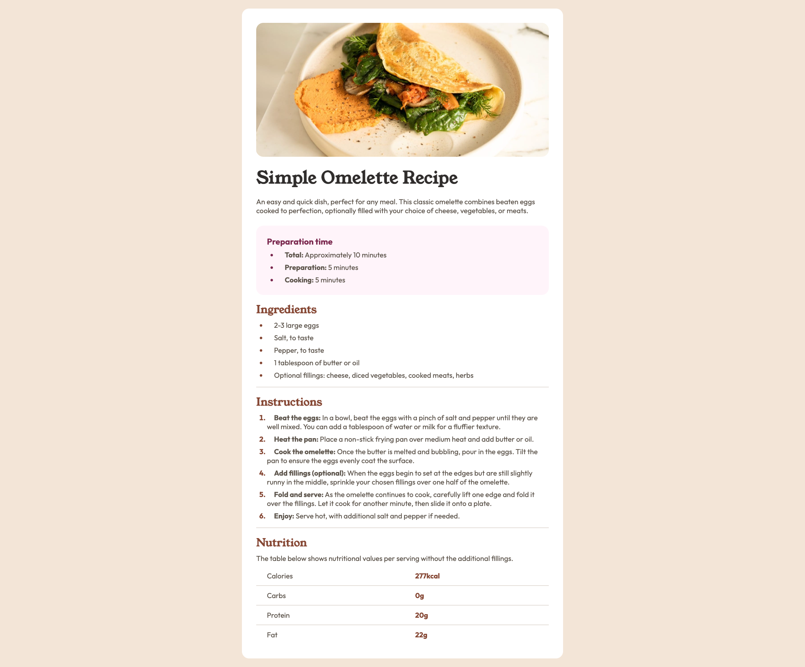

# Recipe Page Solution

This is a Recipe Page that you can use on your websites.

## Table of contents

- [Overview](#overview)
  - [Screenshot](#screenshot)
  - [Links](#links)
- [My process](#my-process)
  - [Built with](#built-with)
  - [What I learned](#what-i-learned)
- [Author](#author)

## Overview

### Screenshot

### Links

- Live Site URL: [Social Links Profile](https://altindaselif.github.io/social-links-profile-main/)

## My process

### Built with

- Semantic HTML5 markup
- CSS custom properties
- Flexbox

### What I learned

I learned how to work with list items. I also learned how to adjust the spacing between the list marker and the text, make the markers bold and change their color. Since I hadn’t worked with tables for a while, I had forgotten how to use them, but this project helped me recall their usage.

## Author

- Linkedin - [Elif Altındaş](https://www.linkedin.com/in/elifaltindas/)
